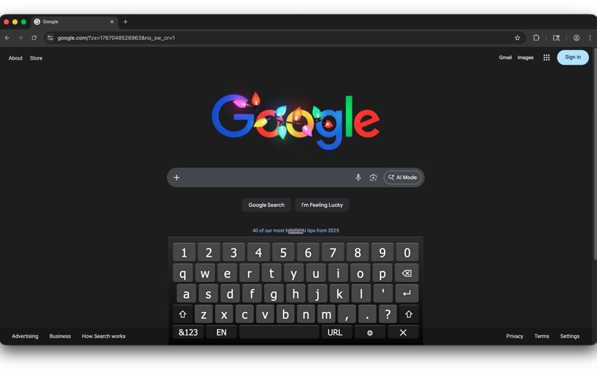

# Virtual Keyboard for Google Chrome&trade; (Fork)



## About

Virtual Keyboard for Google Chrome&trade; will popup automatically when the user clicks on an input field such as textboxes and textareas. Furthermore, the keyboard will disappear automatically once no longer needed.

This extension is ideal for touch screen devices. This keyboard works like an iOS/Android/Windows 8 touch virtual keyboard.

## Fork Differences

This is a fork of the [original Virtual Keyboard extension](https://github.com/xontab/chrome-virtual-keyboard) with the following changes:

- **Manifest V3 Migration** - Updated from Manifest V2 to V3 for continued Chrome Web Store compatibility
- **`role="textbox"` Support** - The keyboard now activates on elements with `role="textbox"` in addition to standard input fields (useful for custom form components and accessibility)
- **Improved iframe Support** - Better handling of keyboard in same-origin iframe scenarios
- **Efficient DOM Monitoring** - Replaced inefficient polling (scanning entire DOM every second) with MutationObserver for detecting new input fields. This uses zero CPU when the page is idle and responds instantly to dynamically added inputs
- **Cursor Positioning** - Type anywhere in a field, not just at the end. Drag on the spacebar to move the cursor
- **Open Button** - Optional floating keyboard button in the lower-right corner to manually show the keyboard (can be disabled in settings)
- **`.com` Button** - Quick-insert ".com" when typing in email fields or the URL bar

All features from the original extension are preserved.

## Permissions

This extension requires the following permissions:

| Permission  | Why It's Needed                                                                         |
| ----------- | --------------------------------------------------------------------------------------- |
| `storage`   | Saves your keyboard layout preference so it persists between browser sessions           |
| `activeTab` | Allows the extension to interact with the current tab when you click the extension icon |

The content script is configured to run on all pages (`<all_urls>`) to detect when you focus on input fields and display the keyboard.

## Development

```bash
pnpm install          # Install dependencies
pnpm build            # Build extension to dist/
pnpm watch            # Build and watch for changes
pnpm format           # Format code with Prettier
pnpm format:check     # Check formatting without writing
pnpm package          # Create zip for Chrome Web Store submission
```

### Testing

```bash
pnpm test:install     # Install Playwright browser (first time setup)
pnpm test             # Run Playwright tests
pnpm test:headed      # Run tests with visible browser
pnpm test:ui          # Run tests with Playwright UI
pnpm test:debug       # Run tests in debug mode
pnpm test:report      # View test report
pnpm coverage         # Run tests with coverage
```

Extension source files are in the `src/` directory.

## Known Limitations

Due to security reasons, communication between frames is restricted in Google Chrome. The only way to enable the keyboard in cross-origin iFrame scenarios is to disable web security using flags `--disable-web-security --disable-site-isolation-trials --user-data-dir=/tmp`. Warning: these flags make Chrome very vulnerable and should only be used for testing.
